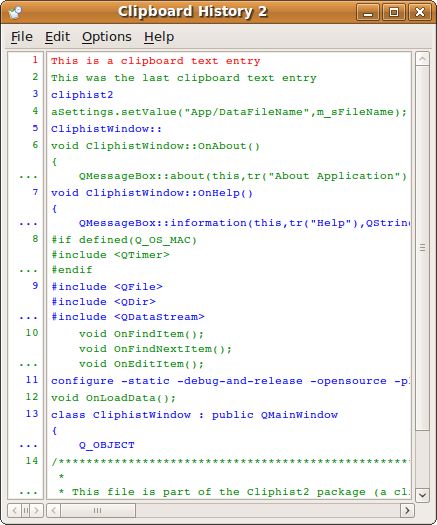

## Cliphist2

### Decription
Cliphist2 is an application to show the history of the text content of the clipboard and to select old entries again.



The application was inspired by the clipboard support of the 
Borland IDE's (Turbo Pascal, Turbo C++) in the 1980ies.
The original application was implemented natively for OS/2 in the year 1994.
Later (in the year 2001) the application was ported to Windows XP.
2009 the author decided to port the application to Mac OS X which 
means a complete rewrite of the application. For this task the 
cross platform toolkit Qt was used. So this means that the 
cliphist2 application is now available for all platforms 
supported by Qt4/Qt5.

See [Homepage](http://www.mneuroth.de/projects/Cliphist2.html) for more details.

### Building from source  
* You can either open project with QtCreator and press the Build button
* Or build it using a terminal:
``` 
qmake -r cliphis2.pro
make
```

### License  
Cliphist2 is released under the GPL
